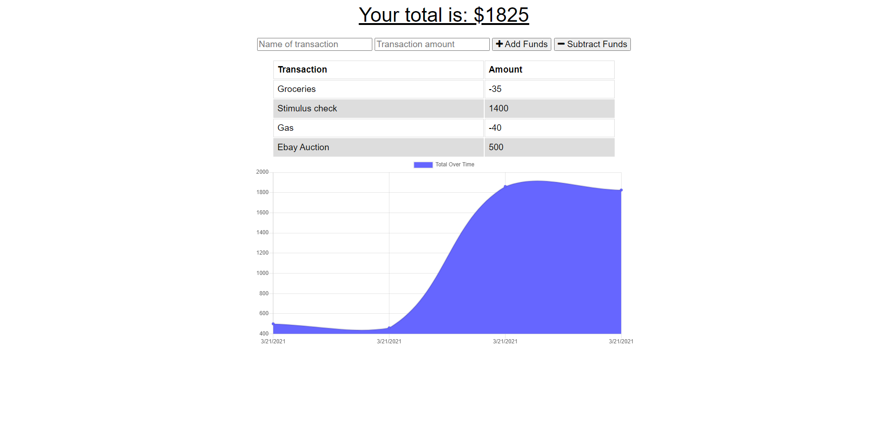

# budget-tracker
## Description 

The purpose of this project is to modify an existing budget tracker application to become a "Progressive Web Applicaiton" and work offline. The offline functionality which has been implemented consists of a webmanifest file which gives basic information concerning the offline application as well as a service worker which holds all the data about which files need to be cached as well as when to used cached data versus when to pull data from the server.

The webpage is hosted on [Heroku](https://infinite-beach-86261.herokuapp.com/).

You can find the repo on [GitHub](https://github.com/Rconat/budget-tracker).

---

## Table of Contents

* [List of Files](#List-of-Files)
* [Usage](#usage)
* [Credits](#credits)

---

## List of Files

<ul>
    <li>server.js</li>
    <li>package-lock.json</li>
    <li>package.json</li>
    <li>README.md</li>
    <li>api.js</li>
    <li>index.html</li>
    <li>index.js</li>
    <li>manifest.webmanifest</li>
    <li>service-worker.js</li>
    <li>styles.css</li>
    <li>icon-192x192.png</li>
    <li>icon-512x512.png</li>
    <li>transaction.js</li>
</ul>

---

## Usage 

This application is available to any user who wishes to have a budget tracker to help track their expenses and incoming revenue. This site is additionally helpful if you're in areas without wifi or internet connection and you would like to store information while offline to be uploaded later when the device returns to an online connection. Users will enter the transaction amount, a description of the transaction, and whether they would like to add those funds, or subtract those funds. The user is then provided with an updated chart showing these transactions as they happen over time.

## Credits

This project was completed by Ryan Conat working alongside professors and TAs through Trinity and Northwestern Coding Bootcamp to provide the file structure and directories as well as the assignment parameters. For this assignment the base code implementing the budget tracker was provided and Ryan completed the code which allowed this application to become a Progressive Web Application and work in offline mode.

---

---